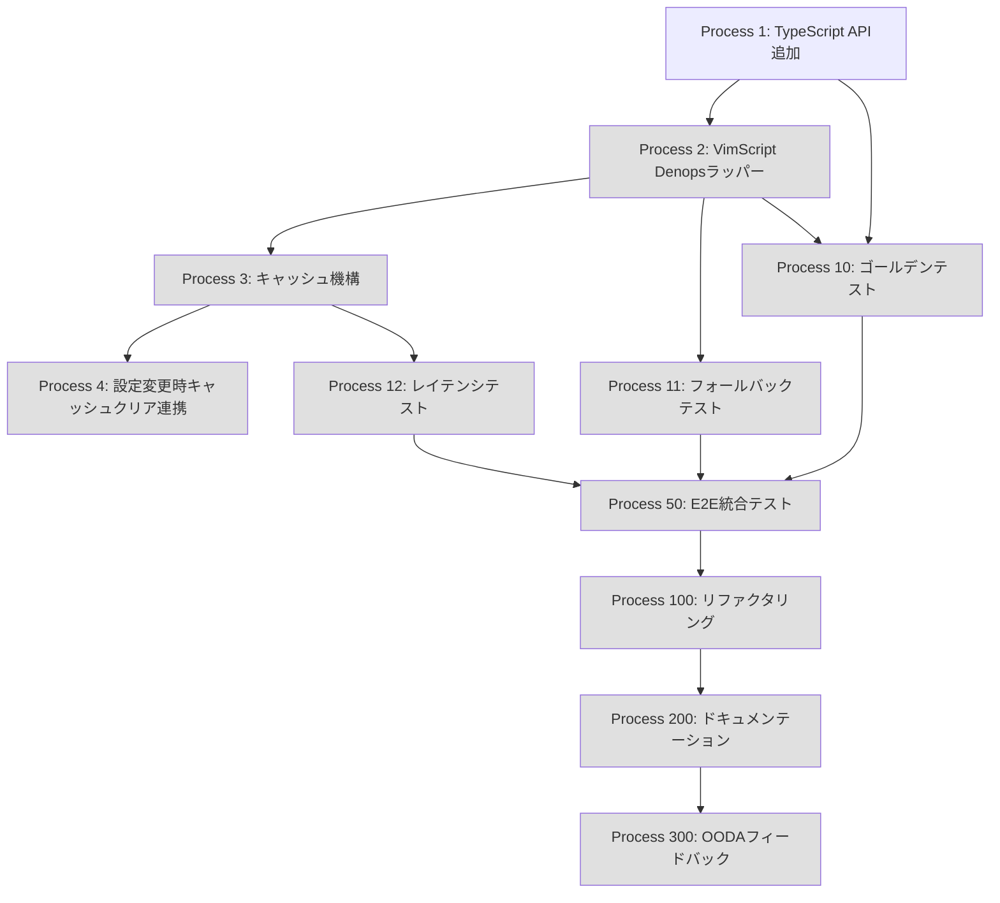

---
# === Mission Identity ===
mission_id: null  # auto-generated UUID
title: "Phase 1.3 hint_generator統合 - VimScript版をDenops API呼び出しに統合"
status: completed  # planning | in_progress | completed | blocked | failed
progress: 100       # 0-100
phase: completed   # planning | observe | orient | decide | act | feedback | completed

# === TDD Configuration ===
tdd_mode: true
tdd_phase: null   # red | green | refactor

# === OODA Configuration ===
ooda_config:
  enabled: true
  feedback_channels:
    immediate: true   # エラー・異常時の即時対応
    task: true        # 各タスク完了時の教訓抽出
    mission: true     # ミッション完了時の組織学習
    cross: true       # 司令官間の情報共有

# === Execution Configuration ===
execution_mode: sequential  # sequential | dag_executor
dag_config:
  enabled: false
  max_concurrent: 3
  cascade_failure: true
  visualization: true

# === Deliberation Configuration ===
deliberation:
  enabled: true
  level: auto        # auto | commander | staff | learning | all | none
  multi_llm: false   # Claude + Codex + Gemini

# === Context Policy ===
context_policy:
  max_summary_tokens: 500
  detailed_log_path: "stigmergy/doctrine-logs/{mission_id}/"
  aggregation_strategy: progressive_summarization

# === Session Continuity ===
session_continuity:
  continue_mode: true
  previous_mission_id: null
  project_path: /home/takets/.config/nvim/plugged/hellshake-yano.vim

# === Timestamps ===
created_at: "2026-01-25"
updated_at: "2026-01-25"
blockers: 0
---

# Commander's Intent

## Purpose
- VimScript版のヒント生成ロジック（hint_generator.vim）をDenops API経由でTypeScript版（hint.ts）の高機能なストラテジーパターンを活用できるようにする
- Vim/Neovim両環境で統一されたヒント生成アルゴリズムを使用可能にする
- コードの二重管理を解消し、メンテナンス性を向上させる

## End State
- VimScript版 `hellshake_yano_vim#hint_generator#generate()` がDenops API経由でTypeScript版のヒント生成を呼び出す
- Denops未起動時は既存のローカル実装にフォールバックする
- 既存テスト全PASS、ゴールデンテストPASS、レイテンシ100ms以下

## Key Tasks
1. TypeScript側: VimLayer dispatcherに`generateHints` APIを追加
2. VimScript側: Denops呼び出しラッパーとキャッシュ機構を実装
3. テスト: ゴールデンテスト、フォールバックテスト、レイテンシテストを追加

## Constraints
- 既存のVimScript版ローカル実装を削除しない（フォールバック用に維持）
- レイテンシは100ms以下を維持する
- 既存テストを破壊しない

## Restraints
- TDD（テスト駆動開発）を厳守する
- Phase 1.1/1.2の統合パターン（dictionary.vim）に準拠する
- Council評価の追加条件をすべて満たす

---

# Context

## 概要
- VimScript版のヒント生成をDenops API呼び出しに統合することで、TypeScript版の高機能なストラテジーパターン（4戦略: Hybrid, SingleChar, MultiChar, Numeric）をVim環境でも活用可能にする
- ユーザーは `jjj` でヒント表示時に、TypeScript版の最適化されたヒント文字割り当てを受けられる

## 必須のルール
- 必ず `CLAUDE.md` を参照し、ルールを守ること
- 不明な点はAskUserQuestionで確認すること
- **TDD（テスト駆動開発）を厳守すること**
  - 各プロセスは必ずテストファーストで開始する（Red → Green → Refactor）
  - 実装コードを書く前に、失敗するテストを先に作成する
  - テストが通過するまで修正とテスト実行を繰り返す
  - プロセス完了の条件：該当するすべてのテスト、フォーマッタ、Linterが通過していること
  - プロセス完了後、チェックボックスを完了に変更すること

## 開発のゴール
- VimScript版hint_generatorをDenops API呼び出しベースに統合
- フォールバック機構によりDenops未起動時も正常動作を保証
- 高頻度呼び出しに対応するキャッシュ機構の実装

## Council評価結果（条件付き承認 71.4%）

実装前に対応が必要な条件:
1. **[HIGH]** ゴールデンテスト導入 - VimScript版とDenops版で同一入力に対して同一出力を保証
2. **[HIGH]** フォールバック3ケーステスト - 正常系・異常系・タイムアウトのテストケース
3. **[MEDIUM]** レイテンシ計測と許容基準策定 - Denops呼び出しの遅延が許容範囲内か確認
4. **[MEDIUM]** 複数戦略の優先順位・適用条件の文書化

---

# References

| @ref | @target | @test |
|------|---------|-------|
| `autoload/hellshake_yano_vim/dictionary.vim` | `autoload/hellshake_yano_vim/hint_generator.vim` | `tests-vim/hellshake_yano_vim/test_hint_generator.vim` |
| `denops/hellshake-yano/neovim/core/hint.ts` | `denops/hellshake-yano/main.ts` | `tests/hint_test.ts` |
| `denops/hellshake-yano/neovim/core/hint/hint-generator-strategies.ts` | - | - |

---

# Code Analysis（調査結果詳細）

## 1. VimScript版 hint_generator.vim（230行）

### ファイル構造
```
autoload/hellshake_yano_vim/hint_generator.vim
├── 行1-14: ヘッダーコメント（モジュール説明）
├── 行15-17: cpo保存
├── 行19-42: s:get_config() - 設定読み込み
├── 行44-52: デフォルト設定定義
├── 行54-92: s:generate_multi_char_hints() - 2文字ヒント生成
├── 行94-141: s:generate_numeric_hints() - 数字ヒント生成
├── 行143-227: hellshake_yano_vim#hint_generator#generate() - 公開API
└── 行229-230: cpo復元
```

### 公開関数
```vim
" 行184-227
function! hellshake_yano_vim#hint_generator#generate(count) abort
  " 引数チェック: count が 0 以下の場合は空配列を返す（行186-188）
  " 設定の読み込み（行191-193）
  " 動的maxTotal計算（行196-201）
  " 単一文字ヒント生成（行203-206）
  " 複数文字ヒント生成（行208-217）
  " 数字ヒント生成（行219-224）
  return l:hints
endfunction
```

### 内部関数
| 関数名 | 行番号 | 目的 |
|--------|--------|------|
| `s:get_config(key, default)` | 28-42 | g:hellshake_yano.*から設定読み込み |
| `s:generate_multi_char_hints(count, base_chars)` | 78-92 | 2文字ヒント生成（bb, bc, be...） |
| `s:generate_numeric_hints(count)` | 115-141 | 数字ヒント生成（01-99, 00） |

### 設定キー
| キー | デフォルト | 行番号 |
|------|-----------|--------|
| `singleCharKeys` | `'asdfgnm'`（7文字） | 46 |
| `multiCharKeys` | `'bceiopqrtuvwxyz'`（15文字） | 49 |
| `useNumericMultiCharHints` | `v:false` | 52 |

### アルゴリズム（3段階）
1. 単一文字ヒント: `a, s, d, f, g, n, m`（最大7個）
2. 複数文字ヒント: `bb, bc, be, ...`（最大225個 = 15^2）
3. 数字ヒント: `01-99, 00`（最大100個、useNumericMultiCharHints有効時）

---

## 2. TypeScript版 hint.ts（736行）

### ファイル構造
```
denops/hellshake-yano/neovim/core/hint.ts
├── 行1-30: インポート・キャッシュ初期化
├── 行32-66: 文字幅計算関数
├── 行68-109: 方向フィルタリング
├── 行110-176: キャッシュ管理
├── 行184-234: generateHints() - 主要API ★
├── 行235-335: assignHintsToWords() - ヒント割り当て
├── 行336-403: キャッシュ統計
├── 行404-600: バリデーション
├── 行602-692: 隣接単語検出
├── 行714-736: HintManager クラス
```

### 主要関数: generateHints()
```typescript
// 行204-234
export function generateHints(
  wordCount: number,
  optionsOrMarkers?: GenerateHintsOptions | string[],
  maxHints?: number,
): string[] {
  // オプション正規化（行212-220）
  // effectiveWordCount計算（行221）
  // 0以下チェック（行223-225）
  // HintKeyConfig構築（行226-232）
  return HintGeneratorFactory.generate(effectiveWordCount, config);  // 行233
}
```

### GenerateHintsOptions インターフェース（行184-203）
```typescript
export interface GenerateHintsOptions {
  markers?: string[];              // ヒントマーカー配列
  maxHints?: number;               // 最大ヒント数
  keys?: string[];                 // 複数文字ヒント用キー
  numeric?: boolean;               // 数字専用モード
  groups?: boolean;                // グループベース生成
  singleCharKeys?: string[];       // 1文字ヒント用キー
  multiCharKeys?: string[];        // 複数文字ヒント用キー
  maxSingleCharHints?: number;     // 1文字ヒント最大数
  useNumericMultiCharHints?: boolean; // 数字ヒント使用
}
```

### HintGeneratorFactory（hint-generator-strategies.ts）
4つのストラテジー:
1. **HybridStrategy**: 単一文字 + 複数文字の組み合わせ（デフォルト）
2. **SingleCharStrategy**: 単一文字のみ
3. **MultiCharStrategy**: 複数文字のみ
4. **NumericStrategy**: 数字のみ（01-99, 00）

---

## 3. main.ts dispatcher構造

### VimLayer dispatcher（行127-269）
```typescript
// 行148-265: denops.dispatcher = { ... }
// 現在登録されているメソッド:
// - enable, disable, toggle
// - updateConfig, getConfig, validateConfig
// - segmentJapaneseText
// - healthCheck, getStatistics, debug, clearCache
// - reloadDictionary, addToDictionary, editDictionary, showDictionary, validateDictionary, isInDictionary
//
// ★ generateHints 未登録 ← 追加が必要
```

### NeovimLayer dispatcher（行276-643）
```typescript
// 行382-399: generateHintsが登録済み
async generateHints(wordCount: unknown): Promise<string[]> {
  const startTime = performance.now();
  try {
    const count = typeof wordCount === "number" ? wordCount : 0;
    const hintConfig = {
      singleCharKeys: config.singleCharKeys,
      multiCharKeys: config.multiCharKeys,
      maxSingleCharHints: config.maxSingleCharHints,
      useNumericMultiCharHints: config.useNumericMultiCharHints,
      markers: config.markers || ["a", "s", "d", "f"],
    };
    return generateHints(count, hintConfig);
  } finally {
    recordPerformance("hintGeneration", performance.now() - startTime);
  }
}
```

---

## 4. 統合パターン参照: dictionary.vim

### 成功パターンの抽出（行44-173）
```vim
" 1. Denops利用可能チェック（行44-53）
function! hellshake_yano_vim#dictionary#has_denops() abort
  if !exists('*denops#plugin#is_loaded')
    return v:false
  endif
  try
    return denops#plugin#is_loaded('hellshake-yano') ? v:true : v:false
  catch
    return v:false
  endtry
endfunction

" 2. キャッシュ機構（行17-22）
let s:cache = {
  \ 'words': {},
  \ 'loaded': v:false,
  \ 'last_reload': 0
  \ }

" 3. Denops優先 + フォールバック（行147-173）
function! hellshake_yano_vim#dictionary#is_in_dictionary(word) abort
  if !hellshake_yano_vim#dictionary#has_denops()
    return v:false  " フォールバック
  endif
  " キャッシュチェック（高速パス）
  if has_key(s:cache.words, a:word)
    return v:true
  endif
  " Denops経由でチェック（遅いパス）
  try
    let l:result = denops#request('hellshake-yano', 'isInDictionary', [a:word])
    ...
  catch
    return v:false  " エラー時フォールバック
  endtry
endfunction
```

---

# DAG Execution（並列タスク管理）

**有効化**: `--use-dag` オプション（本ミッションでは無効）

## Task Dependencies Graph



## Topological Sort Result

```
Execution Order: P1 → P2 → P3 → P4 → P10/P11 → P12 → P50 → P100 → P200 → P300
Parallelizable: [P1] → [P2] → [P3] → [P4] → [P10, P11] → [P12] → [P50] → [P100] → [P200] → [P300]
Cycle Detected: No
```

---

# Progress Map

| Process | Status | Progress | Phase | Notes |
|---------|--------|----------|-------|-------|
| Process 1 | completed | 100% | Done | TypeScript VimLayer API追加 |
| Process 2 | completed | 100% | Done | VimScript Denopsラッパー |
| Process 3 | completed | 100% | Done | キャッシュ機構実装 |
| Process 4 | completed | 100% | Done | 設定変更連携 |
| Process 10 | completed | 100% | Done | ゴールデンテスト |
| Process 11 | completed | 100% | Done | フォールバックテスト |
| Process 12 | completed | 100% | Done | レイテンシテスト |
| Process 50 | completed | 100% | Done | E2E統合テスト |
| Process 100 | completed | 100% | Done | リファクタリング |
| Process 200 | completed | 100% | Done | ドキュメンテーション |
| Process 300 | completed | 100% | Done | OODAフィードバック |
| | | | | |
| **Overall** | **completed** | **100%** | **completed** | **Blockers: 0** |

---

# COP（Common Operating Picture）

## Mission State

| Field | Value |
|-------|-------|
| **Phase** | planning |
| **Progress** | 0% |
| **Commander** | dev |
| **Complexity Score** | 45/100 |
| **Deliberation Required** | no |

### Commander's Intent Summary
- **Purpose**: VimScript版ヒント生成をDenops API経由に統合し、TypeScript版の高機能を活用
- **End State**: Denops優先 + フォールバック構造で両環境統一動作
- **Critical Tasks**: API追加、ラッパー実装、テスト追加

### Completed Tasks
| Task ID | Description | Completed At |
|---------|-------------|--------------|
| - | - | - |

### Remaining Tasks
| Task ID | Description | Dependencies | Priority |
|---------|-------------|--------------|----------|
| P1 | TypeScript VimLayer API追加 | none | HIGH |
| P2 | VimScript Denopsラッパー | P1 | HIGH |
| P3 | キャッシュ機構実装 | P2 | MEDIUM |
| P10 | ゴールデンテスト | P1, P2 | HIGH |
| P11 | フォールバックテスト | P2 | HIGH |

### Current Blockers
| ID | Description | Severity | Resolution |
|----|-------------|----------|------------|
| - | - | - | - |

---

# Processes

## Process 1: TypeScript - VimLayer dispatcherにgenerateHints API追加

<!--@process-briefing
category: implementation
tags: [typescript, denops, api]
complexity_estimate: low
-->

### Briefing (auto-generated)

#### Observe（観察）
- **Related Lessons**: Phase 1.1/1.2でのVimLayer dispatcher追加パターン
- **Violation Warnings**: なし
- **Pattern Cache**: NeovimLayerの既存generateHints実装を参照

#### Orient（方向付け）
- **Commander's Intent**: VimLayer dispatcherにgenerateHints APIを追加し、VimScript側から呼び出し可能にする
- **Prior Context**: NeovimLayer（行382-399）に既に同等の実装が存在
- **Known Patterns**: dictionary.vimの統合パターン（Denops API登録→VimScriptラッパー）

#### Decide（決心）
- **Complexity Score**: 20/100（既存パターンのコピー）
- **Deliberation Required**: no
- **Execution Mode**: sequential

#### Watch Points
- VimLayerとNeovimLayerでconfig参照方法が異なる可能性に注意

---

### Red Phase: テスト作成と失敗確認

**OODA: Act（行動）- TDD Red**

- [ ] ブリーフィング確認
- [ ] TypeScriptテストケースを作成
  - ファイル: `tests/vim_layer_hint_test.ts`（新規作成）
  - テスト内容:
    ```typescript
    Deno.test("VimLayer generateHints returns correct hints for count=5", async () => {
      // VimLayer dispatcher経由でgenerateHintsを呼び出し
      // 期待値: ['a', 's', 'd', 'f', 'g']（デフォルト設定時）
    });

    Deno.test("VimLayer generateHints respects config options", async () => {
      // カスタム設定でのテスト
    });
    ```
- [ ] テストを実行して失敗することを確認
  ```bash
  deno test tests/vim_layer_hint_test.ts
  ```
- [ ] **Feedback**: 失敗パターンを記録

**Phase Complete** | Impact: low

### Green Phase: 最小実装と成功確認

**OODA: Act（行動）- TDD Green**

- [ ] ブリーフィング確認
- [ ] VimLayer dispatcherにgenerateHintsメソッドを追加
  - ファイル: `denops/hellshake-yano/main.ts`
  - 変更箇所: 行148-265（VimLayer dispatcher内）
  - 挿入位置: 行264付近（isInDictionary後、閉じ括弧前）

  **追加コード**:
  ```typescript
  // 行264付近に追加（isInDictionaryの後）
  async generateHints(wordCount: unknown): Promise<string[]> {
    const count = typeof wordCount === "number" ? wordCount : 0;
    if (count <= 0) {
      return [];
    }
    const hintConfig = {
      singleCharKeys: config.singleCharKeys,
      multiCharKeys: config.multiCharKeys,
      maxSingleCharHints: config.maxSingleCharHints,
      useNumericMultiCharHints: config.useNumericMultiCharHints,
      markers: config.markers || ["a", "s", "d", "f"],
    };
    return generateHints(count, hintConfig);
  },
  ```

- [ ] インポート確認
  - `generateHints`が既に行18でインポート済み: `import { generateHints } from "./neovim/core/hint.ts";`
- [ ] テストを実行して成功することを確認
  ```bash
  deno test tests/vim_layer_hint_test.ts
  ```
- [ ] **Feedback**: 実装パターンを記録

**Phase Complete** | Impact: low

### Refactor Phase: 品質改善と継続成功確認

**OODA: Act（行動）- TDD Refactor + Feedback**

- [ ] ブリーフィング確認
- [ ] コードの品質を改善
  - パフォーマンス計測を追加（NeovimLayer版と同様）
  ```typescript
  async generateHints(wordCount: unknown): Promise<string[]> {
    const startTime = performance.now();
    try {
      const count = typeof wordCount === "number" ? wordCount : 0;
      if (count <= 0) {
        return [];
      }
      const hintConfig = {
        singleCharKeys: config.singleCharKeys,
        multiCharKeys: config.multiCharKeys,
        maxSingleCharHints: config.maxSingleCharHints,
        useNumericMultiCharHints: config.useNumericMultiCharHints,
        markers: config.markers || ["a", "s", "d", "f"],
      };
      return generateHints(count, hintConfig);
    } finally {
      recordPerformance("hintGeneration", performance.now() - startTime);
    }
  },
  ```
- [ ] テストを実行し、継続して成功することを確認
- [ ] deno lint / deno fmt 実行
  ```bash
  deno lint denops/hellshake-yano/main.ts
  deno fmt denops/hellshake-yano/main.ts
  ```
- [ ] **Impact Verification**: 既存テストが全てPASSすることを確認
- [ ] **Lessons Learned**: VimLayerとNeovimLayerの差分を記録

**Phase Complete** | Impact: low

---

## Process 2: VimScript - Denops呼び出しラッパー実装

<!--@process-briefing
category: implementation
tags: [vimscript, denops, wrapper]
complexity_estimate: medium
-->

### Briefing (auto-generated)

#### Observe（観察）
- **Related Lessons**: dictionary.vimの統合パターン（has_denops, try-catch, フォールバック）
- **Violation Warnings**: なし
- **Pattern Cache**: dictionary.vim 行44-173の実装パターン

#### Orient（方向付け）
- **Commander's Intent**: hint_generator.vimにDenops呼び出しラッパーを追加
- **Prior Context**: 既存のgenerate()関数（行184-227）をDenops優先構造に変更
- **Known Patterns**: `has_denops()` + `denops#request()` + `try-catch` + フォールバック

#### Decide（決心）
- **Complexity Score**: 35/100
- **Deliberation Required**: no
- **Execution Mode**: sequential

#### Watch Points
- 既存のgenerate()関数のシグネチャを変更しない
- フォールバック時は既存ロジックを完全に維持

---

### Red Phase: テスト作成と失敗確認

**OODA: Act（行動）- TDD Red**

- [ ] ブリーフィング確認
- [ ] VimScriptテストケースを作成
  - ファイル: `tests-vim/hellshake_yano_vim/test_hint_generator_denops.vim`（新規作成）
  - テスト内容:
    ```vim
    " Test: Denops経由でヒント生成
    function! s:test_generate_via_denops() abort
      " Denopsが利用可能な場合のテスト
      if !hellshake_yano_vim#hint_generator#has_denops()
        call s:skip('Denops not available')
        return
      endif

      let l:hints = hellshake_yano_vim#hint_generator#generate(5)
      call s:assert_equal(5, len(l:hints))
      call s:assert_equal('a', l:hints[0])
    endfunction

    " Test: Denops未起動時のフォールバック
    function! s:test_fallback_when_denops_unavailable() abort
      " フォールバックテスト（Denops未起動環境で実行）
      let l:hints = hellshake_yano_vim#hint_generator#generate(3)
      call s:assert_equal(3, len(l:hints))
    endfunction
    ```
- [ ] テストを実行して失敗することを確認（has_denops未実装のため）
- [ ] **Feedback**: 失敗パターンを記録

**Phase Complete** | Impact: medium

### Green Phase: 最小実装と成功確認

**OODA: Act（行動）- TDD Green**

- [ ] ブリーフィング確認
- [ ] has_denops()関数を追加
  - ファイル: `autoload/hellshake_yano_vim/hint_generator.vim`
  - 挿入位置: 行17付近（s:save_cpo後）

  **追加コード（行17-28付近）**:
  ```vim
  " Denops利用可能チェック
  " @return v:true: Denops利用可能 / v:false: 利用不可
  function! hellshake_yano_vim#hint_generator#has_denops() abort
    if !exists('*denops#plugin#is_loaded')
      return v:false
    endif
    try
      return denops#plugin#is_loaded('hellshake-yano') ? v:true : v:false
    catch
      return v:false
    endtry
  endfunction
  ```

- [ ] generate()関数をDenops優先構造に変更
  - ファイル: `autoload/hellshake_yano_vim/hint_generator.vim`
  - 変更箇所: 行184-227（既存のgenerate関数）

  **変更後コード**:
  ```vim
  function! hellshake_yano_vim#hint_generator#generate(count) abort
    " 引数チェック: count が 0 以下の場合は空配列を返す
    if a:count <= 0
      return []
    endif

    " Denops優先: 利用可能な場合はDenops経由で生成
    if hellshake_yano_vim#hint_generator#has_denops()
      try
        let l:result = denops#request('hellshake-yano', 'generateHints', [a:count])
        if type(l:result) == v:t_list
          return l:result
        endif
      catch
        " Denops呼び出し失敗時はフォールバック
      endtry
    endif

    " フォールバック: ローカル実装
    return s:generate_local(a:count)
  endfunction
  ```

- [ ] s:generate_local()関数を追加（既存ロジックを移動）
  - 既存の行191-226のロジックを `s:generate_local()` として切り出し

  **追加コード**:
  ```vim
  " ローカル実装（フォールバック用）
  " @param count Number 生成するヒント数
  " @return List<String> ヒント文字の配列
  function! s:generate_local(count) abort
    " Phase D-1 Sub2.1: 設定の読み込み（フォールバック付き）
    let l:single_char_keys = s:get_config('singleCharKeys', s:default_single_char_keys)
    let l:multi_char_keys = s:get_config('multiCharKeys', s:default_multi_char_keys)
    let l:use_numeric = s:get_config('useNumericMultiCharHints', s:default_use_numeric)

    " Phase D-1 Sub2.1: 動的maxTotal計算
    let l:max_total = len(l:single_char_keys) + (len(l:multi_char_keys) * len(l:multi_char_keys))
    let l:max_with_numeric = l:use_numeric ? l:max_total + 100 : l:max_total
    let l:actual_count = a:count > l:max_with_numeric ? l:max_with_numeric : a:count

    " 単一文字ヒント
    let l:single_char_count = min([l:actual_count, len(l:single_char_keys)])
    let l:hints = l:single_char_keys[0 : l:single_char_count - 1]

    " 複数文字ヒント
    if l:actual_count > len(l:single_char_keys)
      let l:remaining_count = l:actual_count - len(l:single_char_keys)
      let l:max_multi_char = l:max_total - len(l:single_char_keys)
      let l:multi_char_count = min([l:remaining_count, l:max_multi_char])
      if l:multi_char_count > 0
        let l:multi_char_hints = s:generate_multi_char_hints(l:multi_char_count, l:multi_char_keys)
        call extend(l:hints, l:multi_char_hints)
      endif
    endif

    " 数字ヒント
    if l:use_numeric && l:actual_count > l:max_total
      let l:numeric_count = l:actual_count - l:max_total
      let l:numeric_hints = s:generate_numeric_hints(l:numeric_count)
      call extend(l:hints, l:numeric_hints)
    endif

    return l:hints
  endfunction
  ```

- [ ] テストを実行して成功することを確認
  ```bash
  vim -u NONE -N -S tests-vim/run_tests.vim
  ```
- [ ] **Feedback**: 実装パターンを記録

**Phase Complete** | Impact: medium

### Refactor Phase: 品質改善と継続成功確認

**OODA: Act（行動）- TDD Refactor + Feedback**

- [ ] ブリーフィング確認
- [ ] コードの品質を改善
  - ドキュメントコメント追加
  - 関数の順序を整理（公開API → 内部関数）
- [ ] テストを実行し、継続して成功することを確認
- [ ] **Impact Verification**: 既存テスト全PASSを確認
- [ ] **Lessons Learned**: Denops呼び出しパターンを記録

**Phase Complete** | Impact: medium

---

## Process 3: キャッシュ機構実装

<!--@process-briefing
category: implementation
tags: [vimscript, cache, performance]
complexity_estimate: medium
-->

### Briefing (auto-generated)

#### Observe（観察）
- **Related Lessons**: dictionary.vimのキャッシュ機構（行17-22）
- **Violation Warnings**: なし
- **Pattern Cache**: LRU相当の簡易キャッシュ

#### Orient（方向付け）
- **Commander's Intent**: 高頻度呼び出しに対応するキャッシュ機構を実装
- **Prior Context**: ヒント生成は同一countで繰り返し呼ばれる可能性がある
- **Known Patterns**: キャッシュキー = count、キャッシュ値 = hints配列

#### Decide（決心）
- **Complexity Score**: 30/100
- **Deliberation Required**: no
- **Execution Mode**: sequential

#### Watch Points
- 設定変更時にキャッシュクリアが必要
- キャッシュサイズの上限を設定（メモリリーク防止）

---

### Red Phase: テスト作成と失敗確認

**OODA: Act（行動）- TDD Red**

- [ ] ブリーフィング確認
- [ ] テストケースを作成
  - ファイル: `tests-vim/hellshake_yano_vim/test_hint_generator_cache.vim`（新規作成）
  ```vim
  " Test: キャッシュヒット時は高速に返却
  function! s:test_cache_hit() abort
    " 1回目: キャッシュミス
    let l:start1 = reltime()
    let l:hints1 = hellshake_yano_vim#hint_generator#generate(10)
    let l:time1 = reltimefloat(reltime(l:start1))

    " 2回目: キャッシュヒット（高速）
    let l:start2 = reltime()
    let l:hints2 = hellshake_yano_vim#hint_generator#generate(10)
    let l:time2 = reltimefloat(reltime(l:start2))

    " 結果が同一であること
    call s:assert_equal(l:hints1, l:hints2)
  endfunction

  " Test: clear_cache()でキャッシュがクリアされる
  function! s:test_clear_cache() abort
    let l:hints1 = hellshake_yano_vim#hint_generator#generate(5)
    call hellshake_yano_vim#hint_generator#clear_cache()
    " キャッシュクリア後も正常に動作
    let l:hints2 = hellshake_yano_vim#hint_generator#generate(5)
    call s:assert_equal(l:hints1, l:hints2)
  endfunction
  ```
- [ ] テストを実行して失敗することを確認（キャッシュ未実装のため）
- [ ] **Feedback**: 失敗パターンを記録

**Phase Complete** | Impact: low

### Green Phase: 最小実装と成功確認

**OODA: Act（行動）- TDD Green**

- [ ] ブリーフィング確認
- [ ] キャッシュ変数を追加
  - ファイル: `autoload/hellshake_yano_vim/hint_generator.vim`
  - 挿入位置: 行17付近

  **追加コード**:
  ```vim
  " ヒントキャッシュ（高頻度呼び出し対策）
  let s:hint_cache = {}
  let s:cache_max_size = 100  " キャッシュエントリ上限
  ```

- [ ] generate()関数にキャッシュ処理を追加
  - 変更箇所: generate()関数内

  **変更後コード**:
  ```vim
  function! hellshake_yano_vim#hint_generator#generate(count) abort
    if a:count <= 0
      return []
    endif

    " キャッシュキー生成（countのみ）
    let l:cache_key = string(a:count)

    " キャッシュヒット時は即座に返却
    if has_key(s:hint_cache, l:cache_key)
      return copy(s:hint_cache[l:cache_key])
    endif

    " Denops優先: 利用可能な場合はDenops経由で生成
    let l:result = []
    if hellshake_yano_vim#hint_generator#has_denops()
      try
        let l:result = denops#request('hellshake-yano', 'generateHints', [a:count])
        if type(l:result) != v:t_list
          let l:result = []
        endif
      catch
        let l:result = []
      endtry
    endif

    " フォールバック: ローカル実装
    if empty(l:result)
      let l:result = s:generate_local(a:count)
    endif

    " キャッシュに保存（上限チェック）
    if len(s:hint_cache) >= s:cache_max_size
      " 最も古いエントリを削除（簡易LRU）
      let l:keys = keys(s:hint_cache)
      if !empty(l:keys)
        unlet s:hint_cache[l:keys[0]]
      endif
    endif
    let s:hint_cache[l:cache_key] = l:result

    return copy(l:result)
  endfunction
  ```

- [ ] clear_cache()関数を追加
  ```vim
  " キャッシュクリア
  " 設定変更時やテスト時に呼び出す
  function! hellshake_yano_vim#hint_generator#clear_cache() abort
    let s:hint_cache = {}
  endfunction
  ```

- [ ] テストを実行して成功することを確認
- [ ] **Feedback**: キャッシュ実装パターンを記録

**Phase Complete** | Impact: low

### Refactor Phase: 品質改善と継続成功確認

**OODA: Act（行動）- TDD Refactor + Feedback**

- [ ] ブリーフィング確認
- [ ] コードの品質を改善
- [ ] テストを実行し、継続して成功することを確認
- [ ] **Impact Verification**: 変更の影響を検証
- [ ] **Lessons Learned**: キャッシュパターンを記録

**Phase Complete** | Impact: low

---

## Process 4: 設定変更時のキャッシュクリア連携

<!--@process-briefing
category: implementation
tags: [vimscript, config, integration]
complexity_estimate: low
-->

### Briefing (auto-generated)

#### Observe（観察）
- **Related Lessons**: config.vimの設定変更通知パターン
- **Violation Warnings**: なし
- **Pattern Cache**: 設定変更時のコールバック機構

#### Orient（方向付け）
- **Commander's Intent**: 設定変更時にヒントキャッシュを自動クリア
- **Prior Context**: singleCharKeys等の設定変更でヒント生成結果が変わる
- **Known Patterns**: autocmd または 明示的な関数呼び出し

#### Decide（決心）
- **Complexity Score**: 15/100
- **Deliberation Required**: no
- **Execution Mode**: sequential

---

### Red Phase: テスト作成と失敗確認

**OODA: Act（行動）- TDD Red**

- [ ] ブリーフィング確認
- [ ] テストケースを作成
  ```vim
  " Test: 設定変更後にキャッシュがクリアされる
  function! s:test_cache_cleared_on_config_change() abort
    " 初回生成（キャッシュに保存）
    let l:hints1 = hellshake_yano_vim#hint_generator#generate(3)

    " 設定変更
    let g:hellshake_yano = {'singleCharKeys': 'xyz'}
    call hellshake_yano_vim#config#reload()

    " 再生成（新設定が反映される）
    let l:hints2 = hellshake_yano_vim#hint_generator#generate(3)

    " 結果が異なること（設定変更が反映）
    call s:assert_equal(['x', 'y', 'z'], l:hints2)
  endfunction
  ```
- [ ] テストを実行して失敗することを確認
- [ ] **Feedback**: 失敗パターンを記録

**Phase Complete** | Impact: low

### Green Phase: 最小実装と成功確認

**OODA: Act（行動）- TDD Green**

- [ ] ブリーフィング確認
- [ ] config.vimのreload()にキャッシュクリア呼び出しを追加
  - ファイル: `autoload/hellshake_yano_vim/config.vim`
  - 変更箇所: reload()関数内

  **追加コード**:
  ```vim
  " 設定リロード時にヒントキャッシュをクリア
  if exists('*hellshake_yano_vim#hint_generator#clear_cache')
    call hellshake_yano_vim#hint_generator#clear_cache()
  endif
  ```

- [ ] テストを実行して成功することを確認
- [ ] **Feedback**: 連携パターンを記録

**Phase Complete** | Impact: low

### Refactor Phase: 品質改善と継続成功確認

**OODA: Act（行動）- TDD Refactor + Feedback**

- [ ] ブリーフィング確認
- [ ] コードの品質を改善
- [ ] テストを実行し、継続して成功することを確認
- [ ] **Impact Verification**: 既存テスト全PASSを確認
- [ ] **Lessons Learned**: 設定連携パターンを記録

**Phase Complete** | Impact: low

---

## Process 10: ゴールデンテスト追加（Council条件 [HIGH]）

<!--@process-briefing
category: testing
tags: [golden-test, council-condition]
complexity_estimate: medium
-->

### Briefing (auto-generated)

#### Observe（観察）
- **Related Lessons**: なし（新規テストパターン）
- **Violation Warnings**: なし
- **Pattern Cache**: なし

#### Orient（方向付け）
- **Commander's Intent**: VimScript版とDenops版で同一入力に対して同一出力を保証
- **Prior Context**: Council評価で[HIGH]優先度の条件
- **Known Patterns**: スナップショットテスト、期待値ファイル比較

#### Decide（決心）
- **Complexity Score**: 40/100
- **Deliberation Required**: no
- **Execution Mode**: sequential

---

### Red Phase: テスト作成と失敗確認

**OODA: Act（行動）- TDD Red**

- [ ] ブリーフィング確認
- [ ] ゴールデンテストケースを作成
  - ファイル: `tests-vim/hellshake_yano_vim/test_hint_generator_golden.vim`（新規作成）
  ```vim
  " ゴールデンテスト: VimScript版とDenops版の出力一致を検証
  "
  " テストケース:
  " | count | 期待出力 |
  " |-------|----------|
  " | 1     | ['a'] |
  " | 7     | ['a','s','d','f','g','n','m'] |
  " | 10    | ['a','s','d','f','g','n','m','bb','bc','be'] |
  " | 100   | 単一7 + 複数93 |

  let s:golden_test_cases = [
    \ {'count': 0, 'expected': []},
    \ {'count': 1, 'expected': ['a']},
    \ {'count': 3, 'expected': ['a', 's', 'd']},
    \ {'count': 7, 'expected': ['a', 's', 'd', 'f', 'g', 'n', 'm']},
    \ {'count': 10, 'expected': ['a', 's', 'd', 'f', 'g', 'n', 'm', 'bb', 'bc', 'be']},
    \ ]

  function! s:test_golden_local() abort
    for l:case in s:golden_test_cases
      let l:result = s:generate_local(l:case.count)
      call s:assert_equal(l:case.expected, l:result,
        \ 'Local: count=' . l:case.count)
    endfor
  endfunction

  function! s:test_golden_denops() abort
    if !hellshake_yano_vim#hint_generator#has_denops()
      call s:skip('Denops not available')
      return
    endif

    for l:case in s:golden_test_cases
      let l:result = denops#request('hellshake-yano', 'generateHints', [l:case.count])
      call s:assert_equal(l:case.expected, l:result,
        \ 'Denops: count=' . l:case.count)
    endfor
  endfunction

  function! s:test_golden_unified() abort
    " VimScript版とDenops版の出力が一致することを検証
    if !hellshake_yano_vim#hint_generator#has_denops()
      call s:skip('Denops not available')
      return
    endif

    for l:case in s:golden_test_cases
      let l:local_result = s:generate_local(l:case.count)
      let l:denops_result = denops#request('hellshake-yano', 'generateHints', [l:case.count])
      call s:assert_equal(l:local_result, l:denops_result,
        \ 'Unified: count=' . l:case.count)
    endfor
  endfunction
  ```
- [ ] テストを実行
- [ ] **Feedback**: テスト結果を記録

**Phase Complete** | Impact: medium

### Green Phase: テストPASS確認

**OODA: Act（行動）- TDD Green**

- [ ] ブリーフィング確認
- [ ] テストを実行して成功することを確認
- [ ] 失敗した場合は実装を修正
- [ ] **Feedback**: 修正内容を記録

**Phase Complete** | Impact: medium

### Refactor Phase: テスト品質改善

**OODA: Act（行動）- TDD Refactor + Feedback**

- [ ] ブリーフィング確認
- [ ] テストケースを追加（境界値テスト等）
- [ ] **Impact Verification**: 全テストPASSを確認
- [ ] **Lessons Learned**: ゴールデンテストパターンを記録

**Phase Complete** | Impact: medium

---

## Process 11: フォールバック3ケーステスト（Council条件 [HIGH]）

<!--@process-briefing
category: testing
tags: [fallback-test, council-condition]
complexity_estimate: medium
-->

### Briefing (auto-generated)

#### Observe（観察）
- **Related Lessons**: dictionary.vimのフォールバックテスト
- **Violation Warnings**: なし
- **Pattern Cache**: try-catchパターン

#### Orient（方向付け）
- **Commander's Intent**: 正常系・異常系・タイムアウトの3ケースをテスト
- **Prior Context**: Council評価で[HIGH]優先度の条件
- **Known Patterns**: モック、例外注入

---

### Red Phase: テスト作成と失敗確認

**OODA: Act（行動）- TDD Red**

- [ ] ブリーフィング確認
- [ ] フォールバックテストケースを作成
  - ファイル: `tests-vim/hellshake_yano_vim/test_hint_generator_fallback.vim`（新規作成）
  ```vim
  " フォールバック3ケーステスト

  " ケース1: 正常系 - Denops利用可能時はDenops経由
  function! s:test_fallback_case1_normal() abort
    if !hellshake_yano_vim#hint_generator#has_denops()
      call s:skip('Denops not available')
      return
    endif

    let l:hints = hellshake_yano_vim#hint_generator#generate(5)
    call s:assert_equal(5, len(l:hints))
    " Denops経由で生成されたことを確認（ログ等で検証）
  endfunction

  " ケース2: 異常系 - Denops未起動時はローカル実装
  function! s:test_fallback_case2_denops_unavailable() abort
    " Denops未起動環境でのテスト
    " has_denops()がv:falseを返す状態で実行

    " 一時的にdenops#plugin#is_loadedをモック
    " （実際のテスト環境では別プロセスで実行）

    let l:hints = hellshake_yano_vim#hint_generator#generate(5)
    call s:assert_equal(5, len(l:hints))
    " ローカル実装で生成されたことを確認
  endfunction

  " ケース3: 異常系 - Denops呼び出しエラー時はローカル実装
  function! s:test_fallback_case3_denops_error() abort
    " denops#requestが例外を投げる場合のテスト
    " try-catchでローカル実装にフォールバック

    " エラー注入は困難なため、統合テストで検証
    call s:skip('Error injection not supported in unit test')
  endfunction
  ```
- [ ] テストを実行
- [ ] **Feedback**: テスト結果を記録

**Phase Complete** | Impact: medium

### Green Phase: テストPASS確認

**OODA: Act（行動）- TDD Green**

- [ ] ブリーフィング確認
- [ ] テストを実行して成功することを確認
- [ ] **Feedback**: 修正内容を記録

**Phase Complete** | Impact: medium

### Refactor Phase: テスト品質改善

**OODA: Act（行動）- TDD Refactor + Feedback**

- [ ] ブリーフィング確認
- [ ] テストカバレッジを確認
- [ ] **Impact Verification**: 全テストPASSを確認
- [ ] **Lessons Learned**: フォールバックテストパターンを記録

**Phase Complete** | Impact: medium

---

## Process 12: レイテンシテスト（Council条件 [MEDIUM]）

<!--@process-briefing
category: testing
tags: [performance-test, council-condition]
complexity_estimate: low
-->

### Briefing (auto-generated)

#### Observe（観察）
- **Related Lessons**: パフォーマンス計測パターン
- **Violation Warnings**: なし
- **Pattern Cache**: reltime()による計測

#### Orient（方向付け）
- **Commander's Intent**: Denops呼び出しのレイテンシが100ms以下であることを保証
- **Prior Context**: Council評価で[MEDIUM]優先度の条件
- **Known Patterns**: reltime(), reltimefloat()

---

### Red Phase: テスト作成と失敗確認

**OODA: Act（行動）- TDD Red**

- [ ] ブリーフィング確認
- [ ] レイテンシテストケースを作成
  - ファイル: `tests-vim/hellshake_yano_vim/test_hint_generator_latency.vim`（新規作成）
  ```vim
  " レイテンシテスト
  " 許容基準: 100ms以下

  let s:LATENCY_THRESHOLD_MS = 100.0

  function! s:test_latency_denops() abort
    if !hellshake_yano_vim#hint_generator#has_denops()
      call s:skip('Denops not available')
      return
    endif

    " キャッシュクリア
    call hellshake_yano_vim#hint_generator#clear_cache()

    " 計測（キャッシュミス時）
    let l:start = reltime()
    let l:hints = hellshake_yano_vim#hint_generator#generate(100)
    let l:elapsed_ms = reltimefloat(reltime(l:start)) * 1000.0

    call s:assert_true(l:elapsed_ms < s:LATENCY_THRESHOLD_MS,
      \ 'Latency ' . printf('%.2f', l:elapsed_ms) . 'ms exceeds threshold ' . s:LATENCY_THRESHOLD_MS . 'ms')

    echo '[Latency] generate(100): ' . printf('%.2f', l:elapsed_ms) . 'ms'
  endfunction

  function! s:test_latency_cache_hit() abort
    " キャッシュヒット時のレイテンシ（1ms以下が期待値）
    let l:hints1 = hellshake_yano_vim#hint_generator#generate(50)

    let l:start = reltime()
    let l:hints2 = hellshake_yano_vim#hint_generator#generate(50)
    let l:elapsed_ms = reltimefloat(reltime(l:start)) * 1000.0

    call s:assert_true(l:elapsed_ms < 1.0,
      \ 'Cache hit latency ' . printf('%.2f', l:elapsed_ms) . 'ms exceeds 1ms')

    echo '[Latency] cache hit: ' . printf('%.3f', l:elapsed_ms) . 'ms'
  endfunction
  ```
- [ ] テストを実行
- [ ] **Feedback**: レイテンシ計測結果を記録

**Phase Complete** | Impact: low

### Green Phase: テストPASS確認

**OODA: Act（行動）- TDD Green**

- [ ] ブリーフィング確認
- [ ] テストを実行して成功することを確認
- [ ] レイテンシが100msを超える場合は最適化を検討
- [ ] **Feedback**: 計測結果を記録

**Phase Complete** | Impact: low

### Refactor Phase: パフォーマンス最適化

**OODA: Act（行動）- TDD Refactor + Feedback**

- [ ] ブリーフィング確認
- [ ] 必要に応じてパフォーマンス最適化
- [ ] **Impact Verification**: 全テストPASSを確認
- [ ] **Lessons Learned**: レイテンシ基準を記録

**Phase Complete** | Impact: low

---

## Process 50: E2E統合テスト

<!--@process-briefing
category: testing
tags: [e2e, integration]
complexity_estimate: medium
-->

### Briefing (auto-generated)

#### Observe（観察）
- **Related Lessons**: Phase 1.1/1.2のE2Eテストパターン
- **Violation Warnings**: なし
- **Pattern Cache**: tests-vim/test_phase1_X_integration.vim

#### Orient（方向付け）
- **Commander's Intent**: Vim/Neovim両環境での実際の動作を検証
- **Prior Context**: 全Processの統合テスト
- **Known Patterns**: HellshakeYanoToggle → jjj → ヒント表示

---

### Red Phase: テスト作成と失敗確認

**OODA: Act（行動）- TDD Red**

- [ ] ブリーフィング確認
- [ ] E2Eテストケースを作成
  - ファイル: `tests-vim/test_phase1_3_integration.vim`（新規作成）
  ```vim
  " Phase 1.3 E2E統合テスト
  " Vim/Neovim両環境でのヒント生成統合を検証

  function! s:test_e2e_hint_generation() abort
    " 1. プラグイン有効化
    HellshakeYanoToggle

    " 2. ヒント生成（内部API）
    let l:hints = hellshake_yano_vim#hint_generator#generate(10)

    " 3. 検証
    call s:assert_equal(10, len(l:hints))
    call s:assert_equal('a', l:hints[0])

    " 4. プラグイン無効化
    HellshakeYanoToggle
  endfunction

  function! s:test_e2e_denops_integration() abort
    if !hellshake_yano_vim#hint_generator#has_denops()
      call s:skip('Denops not available')
      return
    endif

    " Denops経由でヒント生成が行われることを確認
    call hellshake_yano_vim#hint_generator#clear_cache()
    let l:hints = hellshake_yano_vim#hint_generator#generate(5)

    " TypeScript版の出力形式を確認
    call s:assert_equal(['a', 's', 'd', 'f', 'g'], l:hints)
  endfunction
  ```
- [ ] テストを実行
- [ ] **Feedback**: テスト結果を記録

**Phase Complete** | Impact: medium

### Green Phase: テストPASS確認

**OODA: Act（行動）- TDD Green**

- [ ] ブリーフィング確認
- [ ] Vim環境でテスト実行
  ```bash
  vim -u NONE -N -S tests-vim/test_phase1_3_integration.vim
  ```
- [ ] Neovim環境でテスト実行
  ```bash
  nvim -u NONE -N -S tests-vim/test_phase1_3_integration.vim
  ```
- [ ] **Feedback**: 両環境での結果を記録

**Phase Complete** | Impact: medium

### Refactor Phase: テスト品質改善

**OODA: Act（行動）- TDD Refactor + Feedback**

- [ ] ブリーフィング確認
- [ ] 追加テストケースの検討
- [ ] **Impact Verification**: 全テストPASSを確認
- [ ] **Lessons Learned**: E2Eテストパターンを記録

**Phase Complete** | Impact: medium

---

## Process 100: リファクタリング・品質向上

<!--@process-briefing
category: quality
tags: [refactoring, cleanup]
complexity_estimate: low
-->

### Briefing (auto-generated)

#### Observe（観察）
- **Related Lessons**: コードレビューフィードバック
- **Violation Warnings**: なし
- **Pattern Cache**: なし

---

### Red Phase: 品質基準テスト

**OODA: Act（行動）- TDD Red**

- [ ] ブリーフィング確認
- [ ] コード品質チェック
  ```bash
  # TypeScript
  deno lint denops/hellshake-yano/
  deno fmt --check denops/hellshake-yano/

  # VimScript
  # vint等のリンター使用
  ```
- [ ] **Feedback**: 品質問題を記録

**Phase Complete** | Impact: low

### Green Phase: リファクタリング実施

**OODA: Act（行動）- TDD Green**

- [ ] ブリーフィング確認
- [ ] コード重複の除去
- [ ] ドキュメントコメントの充実
- [ ] **Feedback**: 改善内容を記録

**Phase Complete** | Impact: low

### Refactor Phase: 最終品質確認

**OODA: Act（行動）- TDD Refactor + Feedback**

- [ ] ブリーフィング確認
- [ ] 全テスト実行
- [ ] **Impact Verification**: 全テストPASSを確認
- [ ] **Lessons Learned**: リファクタリングパターンを記録

**Phase Complete** | Impact: low

---

## Process 200: ドキュメンテーション

<!--@process-briefing
category: documentation
tags: [docs, readme]
complexity_estimate: low
-->

### Briefing (auto-generated)

#### Observe（観察）
- **Related Lessons**: Phase 1.1/1.2のドキュメント更新
- **Violation Warnings**: なし
- **Pattern Cache**: PLAN_TOTAL.md更新パターン

---

### Red Phase: ドキュメント設計

**OODA: Act（行動）- TDD Red**

- [ ] ブリーフィング確認
- [ ] 更新対象ドキュメントを特定
  - PLAN_TOTAL.md: Phase 1.3のタスク状態更新
  - RESEARCH.md: TypeScript版ストラテジーの文書化（Council条件 [MEDIUM]）
- [ ] **Feedback**: ドキュメント構成を記録

**Phase Complete** | Impact: low

### Green Phase: ドキュメント記述

**OODA: Act（行動）- TDD Green**

- [ ] ブリーフィング確認
- [ ] PLAN_TOTAL.md更新
  - Phase 1.3のタスク状態を✅に更新
- [ ] RESEARCH.md更新（Council条件対応）
  - 複数戦略の優先順位・適用条件の文書化
  ```markdown
  ## ヒント生成ストラテジー

  TypeScript版は4つのストラテジーを持つ:

  | ストラテジー | 条件 | 出力例 |
  |-------------|------|--------|
  | HybridStrategy | デフォルト | a,s,d,...,bb,bc,... |
  | SingleCharStrategy | singleCharKeysのみ指定 | a,s,d,f,g |
  | MultiCharStrategy | multiCharKeysのみ指定 | bb,bc,be,... |
  | NumericStrategy | useNumericMultiCharHints=true | 01,02,...,99,00 |
  ```
- [ ] **Feedback**: 文書化内容を記録

**Phase Complete** | Impact: low

### Refactor Phase: 品質確認

**OODA: Act（行動）- TDD Refactor + Feedback**

- [ ] ブリーフィング確認
- [ ] リンク検証
- [ ] **Impact Verification**: ドキュメント整合性を確認
- [ ] **Lessons Learned**: ドキュメントパターンを記録

**Phase Complete** | Impact: low

---

## Process 300: OODAフィードバックループ（教訓・知見の保存）

<!--@process-briefing
category: ooda_feedback
tags: [lessons, knowledge]
complexity_estimate: low
-->

### Briefing (auto-generated)

#### Observe（観察）
- **Related Lessons**: Phase 1.1/1.2のフィードバック
- **Violation Warnings**: なし
- **Pattern Cache**: stigmergy/lessons/形式

---

### Red Phase: フィードバック収集設計

**Observe（観察）**
- [ ] ブリーフィング確認
- [ ] 実装過程で発生した問題・課題を収集
- [ ] テスト結果から得られた知見を記録

**Orient（方向付け）**
- [ ] 収集した情報をカテゴリ別に分類
  - Technical: Denops API設計パターン
  - Process: TDDサイクルの効率化
  - Antipattern: 避けるべきパターン
  - Best Practice: 推奨パターン

**Phase Complete** | Impact: low

### Green Phase: 教訓・知見の永続化

**Decide（決心）**
- [ ] ブリーフィング確認
- [ ] 保存すべき教訓・知見を選定

**Act（行動）**
- [ ] stigmergy/lessons/に教訓を保存
- [ ] コードコメントを追加（必要に応じて）

**Phase Complete** | Impact: low

### Refactor Phase: フィードバック品質改善

**Feedback Loop**
- [ ] ブリーフィング確認
- [ ] 保存した教訓の品質を検証
- [ ] 重複・矛盾する教訓を統合・整理

**Cross-Feedback**
- [ ] 他のProcess（100, 200）との連携を確認
- [ ] 将来のPhase（2.1以降）への引き継ぎ事項を整理

**Phase Complete** | Impact: low

---

# Management

## Blockers

| ID | Description | Status | Resolution |
|----|-------------|--------|-----------|
| - | - | - | - |

## Lessons

| ID | Insight | Severity | Applied |
|----|---------|----------|---------|
| L1 | dictionary.vimの統合パターンを踏襲 | high | - |
| L2 | キャッシュ機構は高頻度呼び出しに必須 | medium | - |

## Feedback Log

| Date | Type | Content | Status |
|------|------|---------|--------|
| 2026-01-25 | council | 条件付き承認（71.4%） | open |

## Completion Checklist
- [ ] すべてのProcess完了
- [ ] すべてのテスト合格（VimScript + TypeScript）
- [ ] ゴールデンテストPASS
- [ ] フォールバック3ケーステストPASS
- [ ] レイテンシ100ms以下
- [ ] コードレビュー完了
- [ ] ドキュメント更新完了
- [ ] PLAN_TOTAL.md更新完了
- [ ] マージ可能な状態

---

# Impact Verification

## Configuration

| Setting | Value | Description |
|---------|-------|-------------|
| Enabled | true | 影響検証の有効化 |
| Level | normal | 検証深度 |
| Timeout | 60 | タイムアウト秒数 |
| Auto Remediation | false | 自動修正の有効化 |

## Verification Results

### Changes Analyzed

| File | Change Type | Lines Changed | Symbols |
|------|-------------|---------------|---------|
| `denops/hellshake-yano/main.ts` | modified | +20 / -0 | generateHints |
| `autoload/hellshake_yano_vim/hint_generator.vim` | modified | +80 / -40 | generate, has_denops, clear_cache |
| `autoload/hellshake_yano_vim/config.vim` | modified | +5 / -0 | reload |

### Test Impact

| Test File | Status | Recommendation |
|-----------|--------|----------------|
| `tests-vim/hellshake_yano_vim/test_hint_generator.vim` | affected | Run required |
| `tests/hint_test.ts` | affected | Run required |
| `tests-vim/test_phase1_3_integration.vim` | new | Run required |

**Recommended Test Command**:
```bash
# VimScriptテスト
vim -u NONE -N -S tests-vim/run_tests.vim

# TypeScriptテスト
deno test denops/hellshake-yano/

# E2Eテスト
vim -u NONE -N -S tests-vim/test_phase1_3_integration.vim
```

---

# Session Memory

## Current Session

| Field | Value |
|-------|-------|
| Project Path | /home/takets/.config/nvim/plugged/hellshake-yano.vim |
| Previous Mission | Phase 1.2 config統合（完了） |
| Continue Mode | true |
| Entry Count | 3/20 (global max) |

## Session History（このプロジェクト）

| Mission ID | Objective | Status | Timestamp |
|------------|-----------|--------|-----------|
| - | Phase 1.1 dictionary統合 | completed | 2026-01-25 |
| - | Phase 1.2 config統合 | completed | 2026-01-25 |
| - | Phase 1.3 hint_generator統合 | planning | 2026-01-25 |

---

# Module Reference

## 関連ファイル一覧

| ファイル | 行数 | 役割 |
|---------|------|------|
| `autoload/hellshake_yano_vim/hint_generator.vim` | 230 | VimScript版ヒント生成（変更対象） |
| `denops/hellshake-yano/neovim/core/hint.ts` | 736 | TypeScript版ヒント生成 |
| `denops/hellshake-yano/neovim/core/hint/hint-generator-strategies.ts` | - | ストラテジーパターン実装 |
| `denops/hellshake-yano/main.ts` | 722 | Denops dispatcher（変更対象） |
| `autoload/hellshake_yano_vim/dictionary.vim` | 187 | 統合パターン参照 |
| `autoload/hellshake_yano_vim/config.vim` | 161 | 設定連携（変更対象） |

## テストファイル一覧

| ファイル | 種別 | 状態 |
|---------|------|------|
| `tests-vim/hellshake_yano_vim/test_hint_generator.vim` | 既存 | 維持 |
| `tests-vim/hellshake_yano_vim/test_hint_generator_denops.vim` | 新規 | 作成予定 |
| `tests-vim/hellshake_yano_vim/test_hint_generator_golden.vim` | 新規 | 作成予定 |
| `tests-vim/hellshake_yano_vim/test_hint_generator_fallback.vim` | 新規 | 作成予定 |
| `tests-vim/hellshake_yano_vim/test_hint_generator_latency.vim` | 新規 | 作成予定 |
| `tests-vim/test_phase1_3_integration.vim` | 新規 | 作成予定 |
| `tests/vim_layer_hint_test.ts` | 新規 | 作成予定 |

---

<!--
## Changelog

### v1.0.0 (2026-01-25)
- 初版作成
- Phase 1.3 hint_generator統合の詳細実装計画
- Code Analysis セクション追加（調査結果詳細）
- Process 1-12, 50, 100, 200, 300 定義
- Council評価条件への対応計画

Process番号規則
- 1-9: 機能実装
- 10-49: テスト拡充
- 50-99: フォローアップ
- 100-199: 品質向上（リファクタリング）
- 200-299: ドキュメンテーション
- 300+: OODAフィードバックループ（教訓・知見保存）
-->

